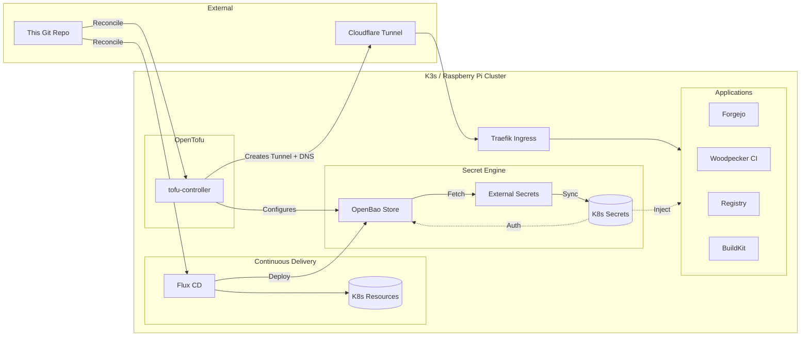

# kudofools-infra

Kubernetes cluster infrastructure managed by Flux CD on a single-node k3s (Raspberry Pi 5, Ubuntu 24.04, 8GB RAM).

## Architecture



## Prerequisites

- Device with k3s installed
- Domain with DNS pointing to the node (via Cloudflare Tunnel)
- Forgejo + Woodpecker already running

## Repo structure

```
clusters/default/
├── flux-system/             # Flux bootstrap (auto-generated)
├── kudofools-infra.yaml     # Kustomization: syncs infra/
├── kudofools-eso.yaml       # Kustomization: syncs eso-resources/
├── kudofools-opentofu.yaml  # Kustomization: syncs opentofu/ Terraform CRD
├── intikepri-*.yaml         # intikepri-related Flux resources
├── infra/                   # Applied by infra
│   ├── system/              # Namespaces, LimitRanges, NetworkPolicies, PVCs
│   ├── platform/
│   │   ├── ingress/         # Traefik Ingress rules + middlewares
│   │   ├── eso/             # External Secrets HelmRelease
│   │   ├── tofu-controller/ # tofu-controller HelmRelease
│   │   ├── image-automation/# Flux image automation controllers
│   │   └── cloudflared/     # Cloudflare Tunnel deployment (config managed by OpenTofu)
│   └── apps/
│       ├── openbao/         # Secrets engine (Vault-compatible)
│       ├── forgejo/         # Git server + CI webhooks
│       ├── registry/        # Internal Docker registry
│       └── woodpecker/      # CI server + agent + buildkitd
├── platform/
│   └── eso-resources/       # ClusterSecretStore + ExternalSecrets
└── opentofu/                # Terraform CRD for OpenTofu
opentofu/                    # OpenTofu IaC (applied by tofu-controller)
    ├── main.tf              # Provider configs
    ├── cloudflare.tf        # Tunnel, credentials Secret, DNS records
    ├── openbao.tf           # OpenBao mounts, policies, auth config
    └── variables.tf         # Input variables
```

## Docs

- [Setup guide](./SETUP.md) — full setup steps
- [Operations](./OPERATIONS.md) — maintenance tasks
