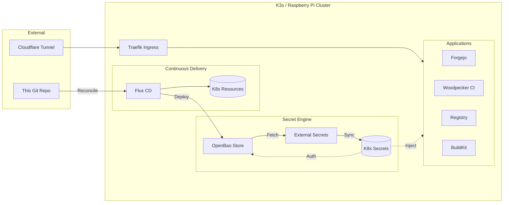

# kudofools-infra

Kubernetes cluster infrastructure managed by Flux CD on a single-node k3s (Raspberry Pi 5, Ubuntu 24.04, 8GB RAM).

## Architecture



## Prerequisites

- Device with k3s installed
- Domain with DNS pointing to the node (via Cloudflare Tunnel)
- Forgejo + Woodpecker already running

## Repo structure

```
clusters/default/
├── flux-system/             # Flux bootstrap (auto-generated)
├── forgejo-infra.yaml       # Kustomization: syncs infra/
├── forgejo-eso.yaml         # Kustomization: syncs platform/eso-resources/
├── infra/                   # Applied by forgejo-infra
│   ├── system/              # LimitRange, NetworkPolicy, PVCs
│   ├── platform/
│   │   ├── ingress/         # Traefik Ingress rules + middlewares
│   │   └── eso/             # External Secrets HelmRelease
│   └── apps/
│       ├── openbao/         # Secrets engine (Vault-compatible)
│       ├── forgejo/         # Git server + CI webhooks
│       ├── registry/        # Internal Docker registry
│       ├── woodpecker/      # CI server + agent + buildkitd
│       └── cloudflared/     # Cloudflare Tunnel
└── platform/
    └── eso-resources/       # ClusterSecretStore + ExternalSecrets
```

## Docs

- [Setup guide](./SETUP.md) — full setup steps
- [Operations](./OPERATIONS.md) — maintenance tasks
